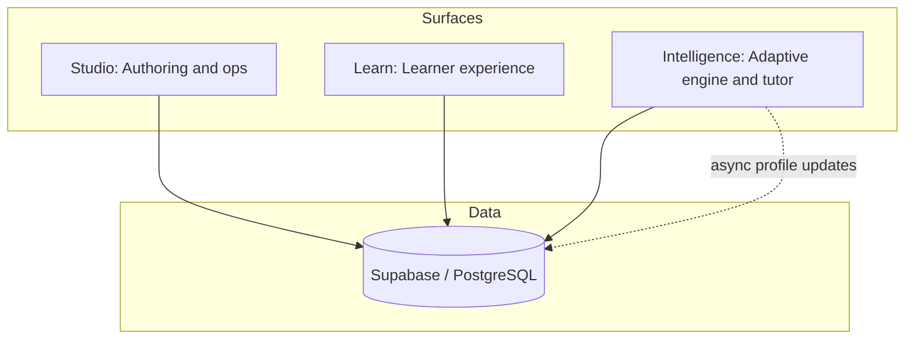
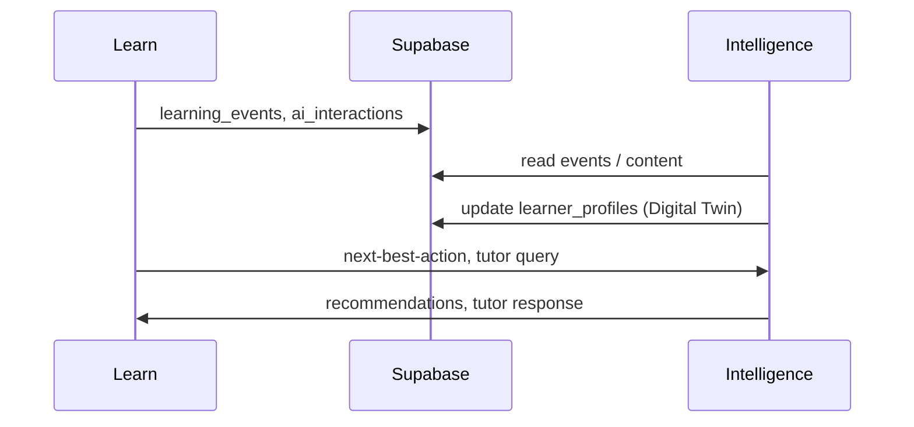

<div align="center">

# Sudar

*Learning that remembers you*

An AI-native learning platform: a full **reference implementation** (authoring, delivery, intelligence) plus an **Adaptive Learning Layer (ALP)** so existing LMSs can add learner memory and adaptive tutoring without replacing their stack.

**Learns with you, for you.**

</div>

---

## Overview

**Sudar** combines:

1. **Reference platform** — **Sudar Studio** (authoring and operations), **Sudar Learn** (learner experience), and **Sudar Intelligence** (adaptive engine and AI tutor **Sudar**), all on a shared **Supabase** data layer. Courses, paths, and a **Digital Learner Twin** capture behaviour, preferences, and tutor context across sessions.
2. **ALP** — A plugin-oriented path to attach memory-aware tutoring, learner modelling, and modality-aware delivery to Moodle, Canvas, or other LMSs you already run—without a full migration.

Most LMSs ship the same experience to everyone and do not keep a longitudinal learner model. Sudar is designed around evidence-informed personalisation ([RESEARCH_FOUNDATION.md](./RESEARCH_FOUNDATION.md)): an open platform (Apache 2.0) with a clear architecture ([ECOSYSTEM.md](./ECOSYSTEM.md)).

### Brand

Sudar uses a single visual system (logo, colour, type) across product and comms. Details: [brand guidelines](./docs/brand/brand-guidelines.md), [design tokens](./docs/brand/design-tokens-v1.md), [visual system](./docs/brand/visual-system.md).

---

## What makes it different

| | Sudar + ALP | Typical LMS + AI |
|--|-------------|------------------|
| **Learner model** | Longitudinal (Digital Learner Twin) | None or stateless |
| **Tutor memory** | Cross-session, cross-course | Usually stateless |
| **Modalities** | Text, video, audio, mind map, flashcards, feed, game, SCORM | Often text/video only |
| **Augment existing LMS** | Yes (ALP direction) | N/A |
| **Open source** | Yes (Apache 2.0) | Rarely |

**Highlights**

- **Tutor that remembers** — Sudar uses the learner profile and past interactions ([how memory works](./docs/sudar-memory.md)).
- **Adaptive paths** — Next-best-action, struggle signals, optional ordering tuned to the learner.
- **Author once, deliver many ways** — One authoring flow; learners can use text, video, audio, mind map, flashcards, and more.
- **Paths and compliance** — Assign paths with due dates, track overdue / at-risk / on-track, shareable certificates.

---

## Architecture

Three surfaces, one shared data layer (see [ECOSYSTEM.md](./ECOSYSTEM.md); ALP framing in [draft system paper](./docs/LAMP-Updated-Draft.md)):



| Surface | Role | Default port |
|---------|------|--------------|
| **Studio** | Courses, paths, assignments, analytics | 3000 |
| **Learn** | Enrolment, learning, Sudar tutor, progress, certificates | 3001 |
| **Intelligence** | Adaptive engine, tutor, next-best-action (optional FastAPI service) | 8000 |

Learner actions and tutor exchanges feed `learning_events` and `ai_interactions`; Intelligence updates the Digital Learner Twin.

### Data flow (high level)



---

## Screenshots and demo

Place product screenshots under [docs/screenshots/](./docs/screenshots/) (suggested names in that folder). Short demo script: [docs/screenshots/DEMO_VIDEO.md](./docs/screenshots/DEMO_VIDEO.md).

---

## Research

Capabilities map to references in [RESEARCH_FOUNDATION.md](./RESEARCH_FOUNDATION.md). If you use Sudar in research, please cite the repo (see below).

---

## Repository layout

Legacy folder names (`byteos-*`) match the repo layout; the product name is **Sudar**.

```
Sudar/
├── README.md
├── RESEARCH_FOUNDATION.md
├── ECOSYSTEM.md              ← Schema, phases, architecture (start here for contributors)
├── AGENTS.md                 ← AI agent / contributor conventions
├── docs/
│   ├── PRODUCT_FEATURES.md, USER_FLOWS.md, STRATEGIC_PATH.md, …
│   └── sudar-memory.md       ← Tutor memory
├── byteos-studio/            ← Sudar Studio (Next.js 14) — port 3000
├── byteos-learn/             ← Sudar Learn (Next.js 14) — port 3001
├── byteos-intelligence/      ← Sudar Intelligence (FastAPI) — port 8000
└── byteos-video/             ← Video generation (optional)
```

---

## Quick start

**Prerequisites:** Node.js 18+, a [Supabase](https://supabase.com) project, and at least one AI provider key (e.g. [Together AI](https://together.ai)).

```bash
git clone https://github.com/Dhanikesh-Karunanithi/Sudar.git
cd Sudar
```

1. **Supabase** — Create a project, apply schema/migrations from `ECOSYSTEM.md` (or Prisma in each app), and note URL, anon key, and service role key.
2. **Studio** — `cd byteos-studio`, copy `.env.example` to `.env.local`, set Supabase and AI keys, then `npm install`, `npx prisma db push`, `npm run dev` → http://localhost:3000.
3. **Learn** — `cd byteos-learn`, same keys in `.env.local`, `npm install`, `npm run dev` → http://localhost:3001.
4. **Intelligence** (optional) — `cd byteos-intelligence`, `pip install -r requirements.txt`, configure `.env`, `uvicorn src.api.main:app --reload --port 8000`.

---

## Feature areas

| Area | What you get |
|------|----------------|
| **Authoring** | AI-assisted course generation, markdown, paths with rules, learner assignment and due dates |
| **Learning** | Dashboard, course viewer with Sudar (RAG + memory), quizzes, paths, certificates |
| **Intelligence** | Next-best-action, struggle detection, adaptive ordering, personalised welcome |
| **Compliance** | Due dates, overdue / at-risk / on-track views, shareable certificate links |

Full detail: [docs/PRODUCT_FEATURES.md](./docs/PRODUCT_FEATURES.md).

---

## Tech stack

| Layer | Technology |
|-------|------------|
| Studio & Learn | Next.js 14 (App Router), TypeScript, Tailwind |
| Data | Supabase (PostgreSQL); Prisma in Studio |
| Auth | Supabase Auth |
| AI | Together AI (primary), OpenAI / Anthropic (fallback) |
| Intelligence | Python FastAPI (optional) |

---

## Documentation

| Doc | Purpose |
|-----|---------|
| [ECOSYSTEM.md](./ECOSYSTEM.md) | Architecture and database — read first if you contribute |
| [UPDATES.md](./UPDATES.md) | Changelog-style notes (what changed over time) |
| [RESEARCH_FOUNDATION.md](./RESEARCH_FOUNDATION.md) | Evidence base and citation |
| [docs/sudar-memory.md](./docs/sudar-memory.md) | Longitudinal tutor memory |

---

## Contributing

Contributions aligned with evidence-informed, personalised learning are welcome. Read [ECOSYSTEM.md](./ECOSYSTEM.md) and [AGENTS.md](./AGENTS.md) before large changes. Fork, branch, and open a PR with a clear description.

---

## License and citation

**License:** Apache 2.0 — see [LICENSE](./LICENSE).

**Citation:**

```bibtex
@software{sudar2026,
  author       = {Karunanithi, Dhanikesh and Sudar Contributors},
  title        = {Sudar: An AI-Native Learning Operating System},
  year         = {2026},
  url          = {https://github.com/Dhanikesh-Karunanithi/Sudar},
  note         = {Reference platform and ALP plugin layer for adaptive, memory-aware learning. Research foundation: RESEARCH_FOUNDATION.md}
}
```

---

## Creator

Sudar brings together authoring tools, LMS experience, AI tutoring, and adaptive engines into one open platform and ALP direction so learning can remember the learner—standalone or alongside existing LMSs. **Dhanikesh “Dhani” Karunanithi** is the creator.

<p align="center">
  <strong>Sudar</strong> — Learns with you, for you.
</p>

<p align="center">
  <sub>2026 · Open source · Apache 2.0</sub>
</p>
