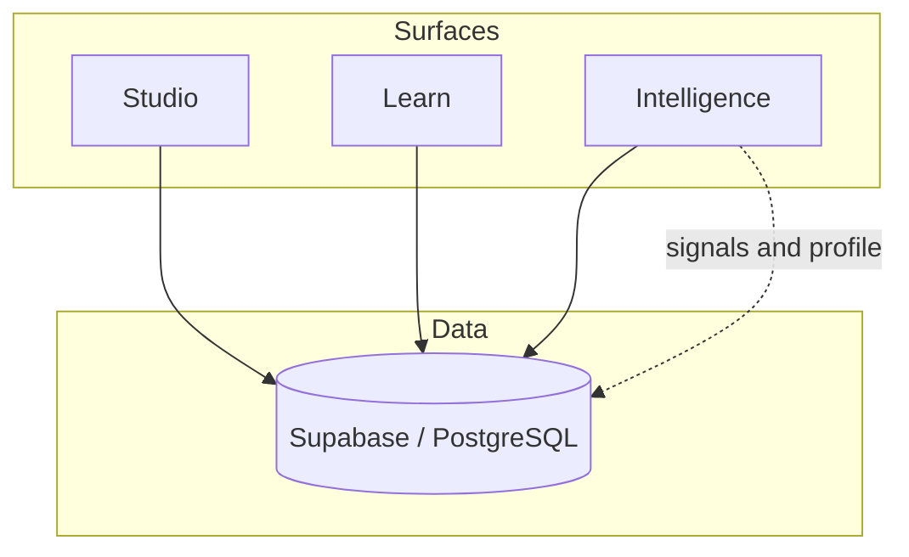

<div align="center">

# Sudar

**The learning platform that actually learns.**

*Learns with you, for you.*

An open-source, **AI-native learning operating system** for teams that need **authoring, delivery, and adaptive intelligence** in one place — with **ALP** (Adaptive Learning Layer): reference HTTP APIs on **Sudar Learn** toward memory-aware tutoring and learner modelling for LMSs you already use (vendor installable plugins are packaging on top of this contract).

[**Website & story →**](https://teachwithsudar.com) · [**Research foundation →**](./RESEARCH_FOUNDATION.md) · [**Full architecture & schema →**](./ECOSYSTEM.md)

</div>

---

## What Sudar does

Most corporate systems **deliver content**. Sudar is built to **learn how each person learns** — a persistent **Digital Learner Twin** (longitudinal profile), a memory-aware AI tutor **Sudar**, and an engine that turns real behaviour into **next-best actions** — with an open, **Apache-2.0** codebase you can audit and extend.

| | Sudar | Typical LMS + “AI features” |
|--|--------|-----------------------------|
| **Learner model** | Durable Digital Learner Twin + telemetry | Shallow or none |
| **Tutor** | Sudar — reactive & proactive (tap-to-reply nudges, cross-session memory) | Often stateless chat |
| **Delivery** | Author once: text, listen (TTS), watch, map, flashcards, SCORM; feed/game where wired or roadmap | Often text/video only |
| **Your existing stack** | **ALP**: APIs and embed paths toward Moodle, Canvas, and similar | Hard to extend |
| **Source** | Open (Apache 2.0) | Usually closed |

The science and design trade-offs behind Sudar are documented in [RESEARCH_FOUNDATION.md](./RESEARCH_FOUNDATION.md). A feature-level checklist lives in [docs/PRODUCT_FEATURES.md](./docs/PRODUCT_FEATURES.md) and [docs/SHIPPED_FEATURES.md](./docs/SHIPPED_FEATURES.md). **Sudar Agents** (bounded orchestration + audit trail) is documented in [docs/AGENTS_PLATFORM.md](./docs/AGENTS_PLATFORM.md).

---

## Three surfaces, one data layer

Sudar is three applications plus a shared data plane:

| Surface | Who it is for | What it does | Default port |
|---------|----------------|--------------|----------------|
| **Sudar Studio** | L&D, admins, creators | Courses, learning paths, assignments, analytics, org settings, governance | 3000 |
| **Sudar Learn** | Learners | Dashboard, course experience, Sudar tutor, paths, progress, certificates | 3001 |
| **Sudar Intelligence** | Your backend | Tutor, TTS, generation, SudarPlay bridge; **next-best-action / twin rollups** are primarily in **Learn** today | **8001** local default when SudarVid uses **8000** |

**Supabase (PostgreSQL)** is the single source of truth: auth, content, `learner_profiles`, `learning_events`, `ai_interactions`, and more — so Studio, Learn, and Intelligence stay aligned. See [ECOSYSTEM.md](./ECOSYSTEM.md) for the canonical schema and roadmap.



`learning_events` and `ai_interactions` power the twin and Sudar; Intelligence reads and writes the same model as the apps.

---

## Sudar Studio — create and operate

- **AI-assisted authoring** — Build courses from documents, URLs, and prompts; RAG for context-aware generation; templates, slide mode, and media search (e.g. stock and web sources).  
- **Import & export** — Document-to-course flows, **SCORM 1.2** import and export, and paths to get existing content in and out.  
- **Learning paths** — Sequences, assignments, due dates, compliance-oriented views, and email reminder hooks where configured.  
- **Analytics** — Completion, time-on-section, risk signals, and org-level reporting (with feature flags and docs for rollout).  
- **Trust & governance** — Org policy, compliance surfaces, and links to a technical **trust pack** under [docs/trust/](./docs/trust/) for security and procurement reviews.

---

## Sudar Learn — the learner experience

- **Personalised workspace** — Dashboard, progress, paths, **next best action**, achievements, check-ins, notifications, and engagement loops where enabled.  
- **Sudar, the tutor** — RAG over course content, **floating** and contextual chat, **proactive** nudges with **tap-to-reply** choices, and longitudinal memory (see [docs/sudar-memory.md](./docs/sudar-memory.md)).  
- **Modality-agnostic learning** — Switch between modalities (e.g. read, listen, watch, map, cards) from a unified course view; SudarVid powers rich **Watch** generation when connected.  
- **Paths & certificates** — Enrolments, unlock rules, certifications, and learner-facing **trust**-aligned behaviour (consent, personalization overlays) where the product and schema support them.

---

## Sudar Intelligence — the AI engine

- **Adaptation** — Difficulty, modality recommendations, and path logic informed by events and profile state.  
- **Tutor & generation** — Server-side AI with provider fallbacks, guardrails, and integration with Learn’s RAG and APIs.  
- **Operational fit** — Designed to run beside Studio and Learn (e.g. Railway, Render, Fly.io); env and deployment notes are in [docs/INTELLIGENCE_DEPLOYMENT.md](./docs/INTELLIGENCE_DEPLOYMENT.md) and [docs/VERCEL_DEPLOYMENT.md](./docs/VERCEL_DEPLOYMENT.md).

---

## More in this repository

- **`sudar_vid/`** — SudarVid: Watch-modality video pipeline (FastAPI, TTS, rendering).  
- **`teachwithsudar/`** — Public-facing marketing / documentation site.  
- **`docs/`** — ALP, trust, brand, environment reference, and strategic path.  
- **Root** — [ECOSYSTEM.md](./ECOSYSTEM.md), [AGENTS.md](./AGENTS.md), [RESEARCH_FOUNDATION.md](./RESEARCH_FOUNDATION.md), and [UPDATES.md](./UPDATES.md) (development and release log).

---

## Quick start

**Prerequisites:** Node.js 18+, a [Supabase](https://supabase.com) project, and at least one AI provider key (e.g. [Together AI](https://together.ai)).

```bash
git clone https://github.com/Dhanikesh-Karunanithi/Sudar.git
cd Sudar
```

1. **Supabase** — Create a project; align schema with [ECOSYSTEM.md](./ECOSYSTEM.md) (and Prisma in each app where used).  
2. **Studio** — `cd sudar-studio`, copy `.env.example` → `.env.local`, set Supabase + AI keys, `npm install`, `npx prisma db push`, `npm run dev` → http://localhost:3000  
3. **Learn** — `cd sudar-learn`, same pattern → http://localhost:3001  
4. **Intelligence** (recommended for full AI features) — `cd sudar-intelligence`, `pip install -r requirements.txt`, configure `.env`, `uvicorn src.api.main:app --reload --port 8001` (use **8000** for SudarVid only). Or run Learn/Studio via `npm run dev` from each app to start SudarVid + Intelligence with defaults (`scripts/dev-with-sudarvid.mjs`).

**Marketing site (optional):** `cd teachwithsudar`, `npm install`, `npm run dev` (see that package’s README for the port).

---

## Documentation map

| Doc | Use when you need… |
|-----|---------------------|
| [ECOSYSTEM.md](./ECOSYSTEM.md) | Schema, ports, phases, and “where does this live?” |
| [RESEARCH_FOUNDATION.md](./RESEARCH_FOUNDATION.md) | Evidence and citations behind design decisions |
| [docs/PRODUCT_FEATURES.md](./docs/PRODUCT_FEATURES.md) | Full feature specification |
| [docs/SHIPPED_FEATURES.md](./docs/SHIPPED_FEATURES.md) | What is shipped and how to use it |
| [docs/STRATEGIC_PATH.md](./docs/STRATEGIC_PATH.md) | Current state and priorities |
| [docs/sudar-memory.md](./docs/sudar-memory.md) | Tutor and longitudinal memory behaviour |
| [AGENTS.md](./AGENTS.md) | Conventions for humans and AI coding agents |
| [UPDATES.md](./UPDATES.md) | Dated product and project updates |

For **brand implementation** (logo, colour, type), see [docs/brand/](./docs/brand/).

---

## Contributing

Issues and PRs that strengthen adaptive, memory-aware learning are welcome. Read [ECOSYSTEM.md](./ECOSYSTEM.md) and [AGENTS.md](./AGENTS.md) before large changes. Use forks, focused branches, and PR descriptions that cover behaviour, data, and any migration steps.

---

## License & citation

**License:** [Apache License 2.0](./LICENSE)

**Citation:**

```bibtex
@software{sudar2026,
  author       = {Karunanithi, Dhanikesh and Sudar Contributors},
  title        = {Sudar: An AI-Native Learning Operating System},
  year         = {2026},
  url          = {https://github.com/Dhanikesh-Karunanithi/Sudar},
  note         = {Reference platform and ALP for adaptive, memory-aware learning; see RESEARCH_FOUNDATION.md}
}
```

---

## Creator

**Sudar** is created by **Dhanikesh “Dhani” Karunanithi** — an integrated response to fragmented authoring tools, static LMSs, and stateless “AI tutors,” with a serious research foundation and an open codebase.

<p align="center">
  <strong>Sudar</strong> — Learns with you, for you.
</p>

<p align="center">
  <sub>Apache 2.0 · Open source</sub>
</p>
