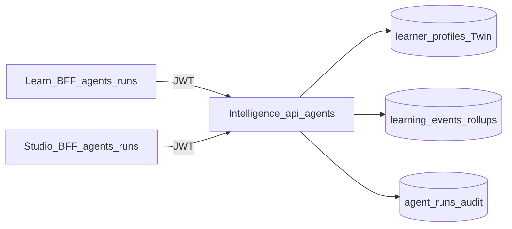

# Sudar Agents platform

This document describes **Sudar Agents**, the product feature: **bounded, task-oriented AI orchestration** for learners and organisation admins. It is **not** the same as [AGENTS.md](../AGENTS.md) in the repo root (that file is instructions for **coding agents** like Cursor).

**Related:** Trust and data posture — [docs/trust/](trust/) · Organisation toggles — **Studio → Org settings → Sudar Agents**.

---

## What Sudar Agents are (plain English)

Sudar Agents are **short “missions”** Sudar runs when you ask: for example, “sketch a focus plan for this learner this week” or “pulse path and cohort health for my org.” Each run produces a **small plan**, may call a **fixed set of tools** (read Twin signals, read recent events, refresh next-best-action via Learn), and stores an **audit row** in Postgres so you can see *that something ran*, not just read a chat transcript.

They are **not** a bundle of separate mascot chatbots. One **gateway** in Sudar Intelligence powers different **teams**:

| Team | Typical user | Example job |
|------|----------------|--------------|
| `learner` | Signed-in learner | `week_plan` — suggested focus grounded in Twin + activity |
| `admin` | Studio Admin / Manager | `path_health` — cohort / path rollup plus risk snippets |

---

## How it works (architecture)

Traffic flows **through your apps**, so the learner’s or admin’s **Supabase JWT** is honoured; the Intelligence service does not blindly trust IDs in the body for those routes.



**Components:**

| Piece | Role |
|-------|------|
| **Sudar Intelligence** `/api/agents/runs`, `/api/agents/runs/stream`, `/api/agents/skills`, `/api/agents/alp-openapi.json` | Orchestrator + tool execution + streaming |
| **Sudar Learn** `/api/agents/runs`, `/api/agents/runs/stream` | Learner BFF (forwards **Bearer JWT only**) |
| **Sudar Learn** `/api/internal/agent-tools/*` | Server-to-server helpers (e.g. NBA parity); guarded by secret |
| **Sudar Studio** `/api/agents/runs` | Admin BFF; requires org Admin/Manager |
| **Supabase `agent_runs`** | Persistence of plans, tool traces, artefacts (Studio **Sudar Agents** page) |

**Do not** send `X-Intelligence-Service-Secret` on the same request as a user JWT to Intelligence unless you intend **service auth** — the gateway may prefer the secret and skip JWT binding.

---

## Science and pedagogy (honest framing)

Sudar Agents are meant to **operationalise** behaviours your platform already leans on — not to claim unsubstantiated learning gains in a lab sense.

- **Digital Learner Twin** plus **telemetry** (`learning_events`, rollups) gives *grounding* for suggestions (what the learner touched, modality switches, quiz load, drop-offs).
- **Next-best-action** logic (canonical scoring in Learn, callable as a tool from Intelligence) encodes lightweight **recovery / modality / pacing** cues consistent with adapting support when engagement drops.
- **Spacing-style nudges** (optional cron — [`sudar-learn` cron `agent-spacing-nudges`](../sudar-learn/src/app/api/cron/agent-spacing-nudges/route.ts)) are **policy-threshold reminders**, not a full spaced-repetition scheduler; tune or disable via org settings (`spacing_nudges`).

Claims in product copy should stay **“suggests” / “helps surface”**, not **“proves mastery.”**

---

## How to use in the UI

### Studio (admins)

1. **Org settings → Sudar Agents** — turn the system on/off and per-feature toggles (**cohort pulse**, learner week-plan API, spacing nudges), policy pack id, default explanation level (**Simple** vs **Advanced**).
2. **Organisation → Sudar Agents** — recent runs table; **Run cohort pulse** triggers an `admin_team` `path_health` run (reads path rollups and risk signals).

### Learn (learners)

- **Dashboard** — when the org enables **learner week plan** and the learner keeps **week plan surfaces** on in **Settings**, a short **“Suggested focus”** strip may appear (server-side call).
- **Settings → Sudar automation** — learner opt-outs for **`week_plan_surfaces`** and **`spacing_nudges`** (org must allow the feature).

There is **no separate “Agents chat”** in v1 — the tutor **Sudar** remains the conversational surface.

---

## Authentication

- **JWT (Supabase)** on `Authorization: Bearer <access_token>` is the primary mode for Learn/Studio BFFs forwarding to Intelligence.
- **`X-Intelligence-Service-Secret`** — Intelligence accepts this for trusted **server-only** workloads (internal Learn tools). See [ENV_REFERENCE](ENV_REFERENCE.md).

---

## Intelligence routes (reference)

| Method | Path | Notes |
|--------|------|--------|
| `POST` | `/api/agents/runs` | Synchronous JSON `AgentRunResponse` |
| `POST` | `/api/agents/runs/stream` | `text/event-stream` (`start`, then `final`) |
| `GET` | `/api/agents/skills` | Logical tool catalogue |
| `GET` | `/api/agents/alp-openapi.json` | Lightweight descriptor for LMS integrators |

### Request schema (minimal)

```json
{
  "team": "learner | admin",
  "actor_user_id": "<uuid>",
  "org_id": "<uuid? required for admin>",
  "user_id": "<uuid? learner subject; defaults to actor for learner_team>",
  "goal_kind": "week_plan | remediation | path_health | spacing_digest | custom",
  "path_id": "<uuid?>",
  "force_nba_refresh": false,
  "policy_pack_id": "default"
}
```

---

## NBA parity (`compute_next_best_action`)

Intelligence `POST /api/learner/next-action` proxies to **`{LEARN_INTERNAL_URL}/api/internal/agent-tools/next-best-action`** with the shared secret so **one** implementation of scoring lives in Learn.

Configure: **Intelligence** — `LEARN_INTERNAL_URL`, `INTELLIGENCE_SERVICE_SECRET` · **Learn** — same secret for inbound validation. See [ENV_REFERENCE](ENV_REFERENCE.md).

---

## Persistence and migrations

Runs are stored in **`public.agent_runs`**. Migration file: [`supabase/migrations/20260502100000_agent_runs.sql`](../supabase/migrations/20260502100000_agent_runs.sql).

**Apply without MCP:** Dashboard SQL Editor, or **`npm run db:apply:agent-runs`** with `SUPABASE_DATABASE_URL` set ([`scripts/apply-agent-runs-sql.cjs`](../scripts/apply-agent-runs-sql.cjs)).

---

## Scheduled spacing nudges (Learn)

`POST /api/cron/agent-spacing-nudges` — `CRON_SECRET`. Respects org **`spacing_nudges`** and learner preference. Thresholds mirror [`sudar-intelligence/src/agents/policies/default.yaml`](../sudar-intelligence/src/agents/policies/default.yaml) and Learn [`defaultPolicyPack`](../sudar-learn/src/lib/agents/defaultPolicyPack.ts).

---

## ALP / LMS integrators

- Descriptor: **`GET /api/agents/alp-openapi.json`** on Intelligence  
- Skills: **`GET /api/agents/skills`**  
Partner flows should use learner or service JWT patterns described in [ALP_API](ALP_API.md).

---

## Ecosystem pointers

| Doc | Topic |
|-----|--------|
| [ECOSYSTEM.md](../ECOSYSTEM.md) | Sudar Intelligence + Agents summary |
| [STRATEGIC_PATH.md](STRATEGIC_PATH.md) | Roadmap / shipped agents scaffold |
| [ENV_REFERENCE.md](ENV_REFERENCE.md) | Env vars |

*Last reviewed: Sudar Agents docs + org settings.*
