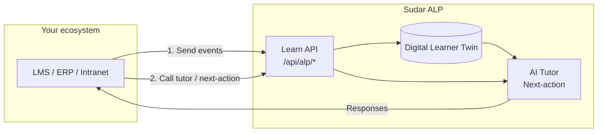
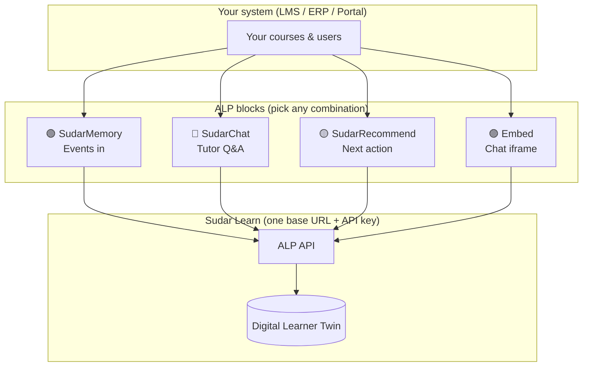
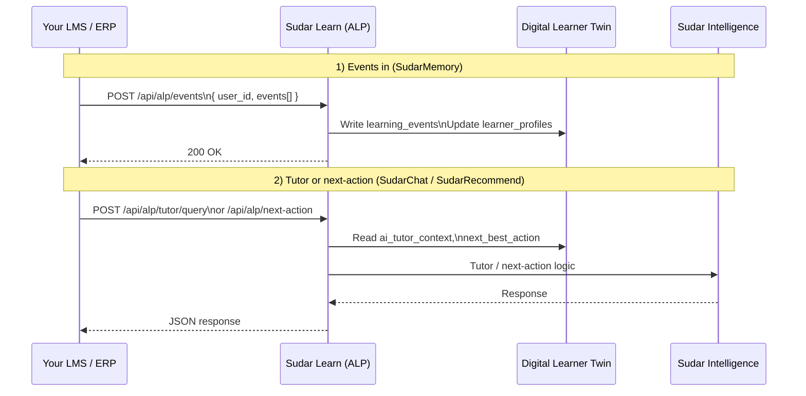
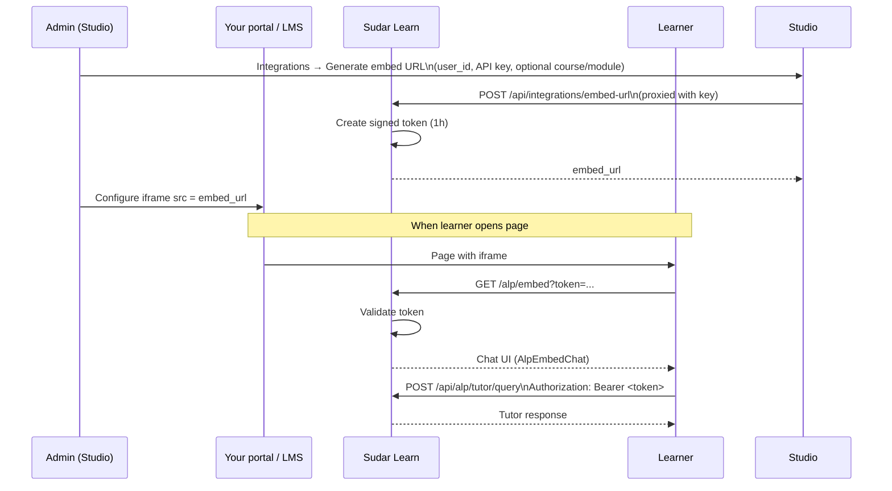
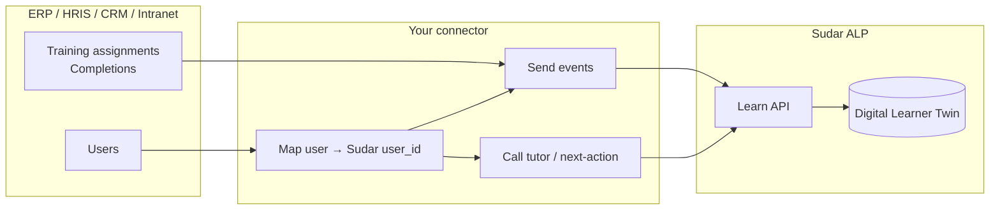
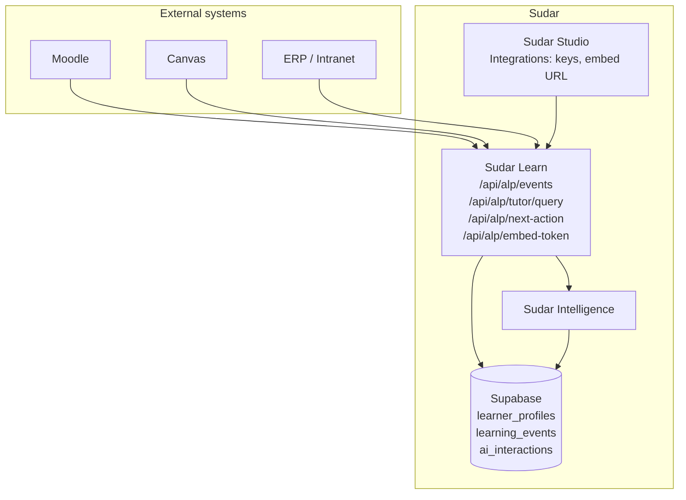

# Sudar integration guide — LMS, ERP, and ecosystem (Lego-style)

**Audience**: Admins and developers who want to add Sudar’s intelligence (Digital Learner Twin, AI tutor, next-best-action) to an existing LMS, ERP, intranet, or partner portal without replacing that system.

**Purpose**: Visual and step-by-step guide so you can follow along like building with Lego: choose the blocks you need (events, tutor, next-action, embed), connect them with one API key, and plug into any ecosystem.

---

## 1. How it fits: ALP as a layer

Sudar’s **Adaptive Learning Layer (ALP)** sits *on top* of your existing system. Your LMS or ERP stays the source of courses, users, and grades; ALP adds a **persistent learner model** (Digital Learner Twin) and **AI tutor / recommendations** that work across courses and sessions.

**You do not migrate content or users into Sudar.** You keep your LMS; you add a thin connector that:

1. **Sends events** (completions, quiz attempts, time-on-task) → ALP writes into the Twin.
2. **Calls tutor or next-action** when the learner asks a question or when you want to show “What to do next”.

---

## 2. Lego-style blocks — what you can plug in

Think of four blocks. Each connects to the same **base URL** and **API key**; you can use any combination.

| Block | What it does | Endpoint / usage |
|-------|----------------|-------------------|
| **SudarMemory** | Sends learning events so Sudar can build the Digital Learner Twin. | `POST /api/alp/events` with `user_id` and `events[]`. |
| **SudarChat** | Learner asks a question; Sudar answers with RAG + memory. | `POST /api/alp/tutor/query` with `user_id`, `message`, optional `course_id`/`module_id`/`context_text`. |
| **SudarRecommend** | “What should I do next?” for your dashboard or home. | `POST /api/alp/next-action` with `user_id`; returns action_type, target_id, reason. |
| **Embed** | Drop-in chat widget: no custom UI. You get a short-lived URL and put it in an iframe. | Generate URL in Studio (Integrations → Embed); use as iframe `src`. Token in URL; expires in 1 hour. |

**Minimum for a useful integration:**  
- **SudarMemory** (so the Twin exists), plus **SudarChat** or **Embed** (so the learner can talk to Sudar).  
**Optional:** Add **SudarRecommend** for a “What to do next” card.

---

## 3. Data flow — events in, Twin updated, tutor/next-action out

- **Events** always go to the **Learn** app (`/api/alp/events`). Learn writes to `learning_events` and runs the same side-effects as internal Learn (enrollment progress, quiz struggles, Twin updates).
- **Tutor and next-action** are proxied by Learn to **Sudar Intelligence**; Learn adds auth and logs to `ai_interactions` where needed.

---

## 4. Embed flow — iframe chat without building a UI

If you don’t want to build a chat UI, use the **embed** block: get a short-lived URL and show Sudar in an iframe.

**Important:** The embed URL expires in **1 hour**. Your portal should request a new URL when the learner opens the embed (e.g. your backend calls `POST /api/alp/embed-token` on Learn with the API key and returns the new `embed_url`).

---

## 5. Incorporating Sudar into your LMS (step-by-step)

Follow these steps for **any** LMS (Moodle, Canvas, Blackboard, custom).

### Step 1: Get base URL and API key

- In **Sudar Studio** → **Organization** → **Integrations**:
  - Note the **Learn app base URL** (e.g. `https://learn.yourorg.com`). It must be set in Studio env as `NEXT_PUBLIC_LEARN_APP_URL`.
  - Create an **Integration API key**. Copy the raw key once (it’s not shown again). Use it in every ALP request as:
    - `x-alp-api-key: <key>` or
    - `Authorization: Bearer <key>`

### Step 2: Map your users to Sudar

- Every ALP request needs a **Sudar `user_id`** (UUID in `profiles`). You have two options:
  - **Option A — LTI / SSO:** When the learner logs in via LTI or your IdP, create or look up a Sudar profile and use its `id` as `user_id`.
  - **Option B — Directory sync:** Use the **Provisioning API** to batch-create users and org membership from your HRIS/SIS. Call `POST <Studio base URL>/api/org/provisioning/users` with an Integration API key (`x-alp-api-key` or `Authorization: Bearer <key>`) and body `{ "users": [ { "email", "full_name?", "role?" } ] }`. See [ENTERPRISE_PROVISIONING.md](ENTERPRISE_PROVISIONING.md#provisioning-api). Then your connector looks up `user_id` by email.
- Same `user_id` across sessions = same Digital Learner Twin and same tutor memory.

### Step 3: Send events (SudarMemory)

- From your LMS (e.g. on completion, quiz submit, or heartbeat), call:
  - `POST <Learn base URL>/api/alp/events`
  - Body: `{ "user_id": "<uuid>", "events": [ { "event_type": "module_complete", "course_id": "...", "module_id": "...", "payload": {}, "modality": "text", "duration_secs": 120 } ] }`
- Map your course/module IDs to Sudar’s if you use Sudar courses; otherwise send `course_id`/`module_id` as null and use `event_type` + `payload` so the Twin still gets behavioural signals.
- **Allowed `event_type` values:** `module_start`, `module_complete`, `quiz_attempt`, `video_play`, `video_pause`, `video_replay`, `section_heartbeat`, `ai_tutor_open`, `ai_tutor_query`, `modality_switch`, `drop_off`, `streak_broken`, `streak_maintained`. See [ALP_API.md](ALP_API.md) for payload shapes.

### Step 4: Add tutor and/or next-action

- **Tutor (SudarChat):**
  - When the learner sends a message, your backend calls `POST <Learn base URL>/api/alp/tutor/query` with `user_id`, `message`, and optionally `course_id`, `module_id`, `context_text` (for RAG). Display the returned `response` in your UI (sidebar, modal, or inline).
  - **Or** use the **Embed** block: generate an embed URL in Studio (or via `POST /api/alp/embed-token`), set your iframe `src` to that URL, and let learners chat in the pre-built widget.
- **Next-action (SudarRecommend):**
  - On your LMS dashboard or home, call `POST <Learn base URL>/api/alp/next-action` with `user_id` (and optionally `current_enrollment_ids`). Show the returned `action_type`, `target_id`, and `reason` as a “What to do next” card.

### Step 5: (Optional) Use an LRS or SCORM/xAPI

- If your LMS already sends **xAPI** or **SCORM** to an LRS, you can:
  - Build a small **adapter** that reads from the LRS (or webhooks), maps statements to ALP `event_type` and payload, and calls `POST /api/alp/events`.
- ALP does not replace your LRS; it consumes events and maintains the Twin. See [ALP_API.md](ALP_API.md) §2 and §8 for mapping rules.

### LTI and LMS options

Sudar works with standard LMS and content standards so you can plug it into existing platforms:

- **LTI 1.3** — Launch Sudar as an LTI tool from **Canvas**, **Blackboard**, or **Moodle**. Your LMS sends the learner context (user_id, course_id); your connector maps to Sudar `user_id` and calls ALP (events, tutor, next-action). A **Moodle connector** is planned; see [LAMP_BUILD_PLAN.md](LAMP_BUILD_PLAN.md).
- **SCORM 1.2** — Supported for packaging and importing content; events can be mapped to ALP.
- **xAPI / LRS** — Send or receive learning statements; use the ALP events API and map to your LRS if needed.

ALP is the intelligence layer: your LMS stays the source of courses and users; ALP adds the Digital Learner Twin and AI tutor. See [ENTERPRISE_PROVISIONING.md](ENTERPRISE_PROVISIONING.md#lti--lms-options) for a short reference.

---

## 6. Incorporating into an ERP or other ecosystem

The same **Lego blocks** apply. The only difference is where events and users come from.

- **ERP / HRIS:** Use training/completion data as events. Map employee ID or email to Sudar `user_id` (via directory sync or at login). Send `module_complete`, `quiz_attempt`, and time-on-task where available. Expose Sudar tutor or next-action in the HR portal or learning widget.
- **CRM:** If your CRM tracks “course completed” or “certification,” send those as events; optionally show “What to do next” in the agent dashboard.
- **Intranet / partner portal:** Same pattern: one API key, user mapping, events + tutor/embed or next-action. Embed is often the fastest way to add value (iframe with no custom UI).

**Lego-style summary:**  
- **User mapping** = one block (directory/LTI/sync).  
- **SudarMemory** = one block (events in).  
- **SudarChat** or **Embed** = one block (tutor).  
- **SudarRecommend** = optional block (next-action).  
Mix and match per product.

---

## 7. Diagram reference — where everything lives

- **Studio** is where admins create API keys and generate embed URLs.  
- **Learn** is the single entry point for ALP (events, tutor, next-action, embed token).  
- **Intelligence** does the tutor and next-action logic; Learn proxies to it.  
- **Supabase** holds the Digital Learner Twin and all events/interactions.

---

## 8. Enterprise & university setup

For universities and enterprises, Sudar can integrate with existing systems in four main ways. All are configurable or documented from **Sudar Studio → Integrations** (and optionally **Settings**).

| Integration | What it does | Where to configure |
|-------------|----------------|-------------------|
| **SSO (SAML / OIDC)** | Single sign-on with Azure AD, Okta, Google Workspace, or other identity providers. Learners sign in with existing org credentials. | Configure in your **Supabase** project (Auth → Providers). Optionally store status or metadata in org settings (`sso_config`) from Studio. See [Supabase SSO docs](https://supabase.com/docs/guides/auth/sso). |
| **Directory / user sync** | Sync users from HRIS (Workday, BambooHR, Rippling) or university SIS. Create or update Sudar profiles and org membership so ALP requests can use Sudar `user_id`. | Use the **Provisioning API**: `POST <Studio URL>/api/org/provisioning/users` with an Integration API key and body `{ "users": [ { "email", "full_name?", "role?" } ] }`. See [ENTERPRISE_PROVISIONING.md](ENTERPRISE_PROVISIONING.md#provisioning-api). Or LTI/SSO at login; or a script that upserts `profiles` and `org_members` via Supabase. |
| **API (ALP)** | Your LMS or portal sends events and calls tutor/next-action. | **Integrations** page: create API keys, note Learn base URL. Use in every request. See [ALP_API.md](ALP_API.md). |
| **Data lakes & batch ingestion** | Batch jobs read from your data lake (e.g. S3, Delta) and POST learning events to the same ALP events endpoint. | Same **API key** and **Learn base URL**. Map your user identifier to Sudar `user_id` (email or external_id). No extra config in Studio beyond keys and base URL. |

**AI and API keys:** Configure chat (OpenRouter, Together, OpenAI, Anthropic), embeddings, TTS, and media keys in **Studio → Settings → AI & API Keys**. Status and “How to get this key” steps are in-app; the full list of environment variables is in [ENV_REFERENCE.md](ENV_REFERENCE.md). Required for course generation and the AI tutor.

**Security:** All provisioning and SSO flows must enforce org scope; never expose other organisations’ data. Use the Integration API key or admin session for server-side calls.

---

## 9. Links and next steps

| Resource | Purpose |
|----------|---------|
| [ALP_API.md](ALP_API.md) | Full API: request/response bodies, auth, event_type values, SCORM/xAPI. |
| [ENTERPRISE_PROVISIONING.md](ENTERPRISE_PROVISIONING.md) | Recommended setups (K-12, Higher ed, Corporate), provisioning API, scaling. |
| [ENV_REFERENCE.md](ENV_REFERENCE.md) | Environment variables for Studio, Learn, Intelligence; AI and API keys. |
| [STUDIO_USER_GUIDE.md](STUDIO_USER_GUIDE.md) | Studio navigation and Integrations page. |
| **Sudar Studio → Integrations** | Create keys, generate embed URL, see Learn base URL, Provisioning checklist, Enterprise cards. |
| **Sudar Studio → Settings → AI & API Keys** | Configure AI providers and see key status; link to ENV_REFERENCE. |

**For admins:** Start with the **Visual guide** on the Integrations page in Studio, then use this document for LMS/ERP patterns and diagrams.  
**For developers:** Use [ALP_API.md](ALP_API.md) for implementation details; use this guide for architecture and Lego-style integration choices.
