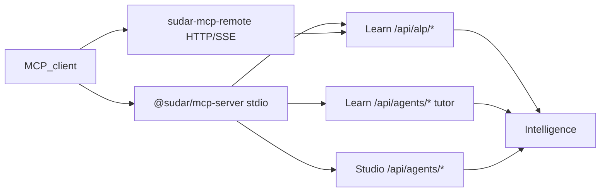

# Sudar MCP servers

**Purpose:** Expose Sudar capabilities to any **Model Context Protocol (MCP)** client (Cursor, Claude Desktop, partner AI apps) as a **thin adapter** over existing HTTP APIs — not a parallel business-logic layer.

**Audience:** Integrators (LMS backends), L&D admins using AI IDEs, and learner-facing assistants (phased).

**Related:** [ALP_API.md](ALP_API.md) (REST contract for LMSs) · [AGENTS_PLATFORM.md](AGENTS_PLATFORM.md) (Sudar Agents gateway) · [ENV_REFERENCE.md](ENV_REFERENCE.md)

---

## Architecture



**Rules:**

1. MCP tools **only** call documented Learn ALP routes, Learn/Studio BFFs, or Intelligence routes already used in production.
2. **Never** expose `SUPABASE_SERVICE_ROLE`, `INTELLIGENCE_SERVICE_SECRET`, or raw database access.
3. **Never** send `X-Intelligence-Service-Secret` together with a user JWT ([AGENTS_PLATFORM.md](AGENTS_PLATFORM.md)).

---

## Packages and deployment

| Artifact | Transport | Use case |
|----------|-----------|----------|
| [`packages/sudar-mcp`](../packages/sudar-mcp) (`@sudar/mcp-server`) | stdio | Local dev, Cursor, CI |
| [`workers/sudar-mcp-remote`](../workers/sudar-mcp-remote) | HTTP + SSE | Local/dev remote MCP (API-key token) |
| [`workers/sudar-mcp-cloudflare`](../workers/sudar-mcp-cloudflare) | Streamable HTTP + OAuth | **Production** — `mcp.thesudar.app` for ChatGPT |
| [`packages/sudar-mcp/examples/mcp.json`](../packages/sudar-mcp/examples/mcp.json) | — | Copy-paste Cursor config |

---

## Authentication matrix

| Mode | Env / header | Tools enabled | Canonical backend |
|------|----------------|---------------|-------------------|
| **Org ALP API key** | `SUDAR_ALP_API_KEY` → `x-alp-api-key` | Integrator | Learn `/api/alp/*` |
| **Supabase access token** | `SUDAR_ACCESS_TOKEN` → `Authorization: Bearer` | Admin + Learner | Studio/Learn BFFs (Bearer supported on agents, tutor, next-action) |
| **Remote MCP token** | `POST /token` on remote worker with API key → short-lived bearer | Integrator (remote) | Same as ALP via proxy |

**JWT tools:** Obtain a Supabase session access token from the Sudar app (browser devtools / Supabase CLI). Pass as `SUDAR_ACCESS_TOKEN`. The token’s `sub` must match the learner or admin actor for agent runs.

**Do not** paste service-role keys into MCP config.

---

## Tool catalog

### Integrator (`SUDAR_TOOLSET=integrator` or default)

Requires `SUDAR_LEARN_URL` + `SUDAR_ALP_API_KEY`.

| Tool | Description | HTTP |
|------|-------------|------|
| `sudar_ingest_learning_events` | Batch write `learning_events` (SudarMemory) | `POST /api/alp/events` |
| `sudar_tutor_query` | Tutor Q&A for a learner `user_id` | `POST /api/alp/tutor/query` |
| `sudar_next_best_action` | Next-best-action card | `POST /api/alp/next-action` |
| `sudar_resolve_lms_user` | Map LMS external id → Sudar UUID | `POST /api/alp/identity/resolve` |
| `sudar_create_embed_token` | Signed embed URL for tutor widget | `POST /api/alp/embed-token` |

### Admin (`SUDAR_TOOLSET=admin` or `all`)

Requires `SUDAR_STUDIO_URL` + `SUDAR_ACCESS_TOKEN` (org Admin/Manager).

| Tool | Description | HTTP |
|------|-------------|------|
| `sudar_run_admin_agent` | Cohort pulse / path health agent run | `POST /api/agents/runs` (Studio BFF) |
| `sudar_list_agent_skills` | Logical tool catalog | `GET` Intelligence `/api/agents/skills` via Studio proxy N/A — MCP calls Intelligence with JWT |

For `sudar_list_agent_skills`, MCP calls `{SUDAR_INTELLIGENCE_URL}/api/agents/skills` with Bearer JWT.

### Creator (`SUDAR_TOOLSET=creator` or `all`)

Requires `SUDAR_STUDIO_URL` + `SUDAR_ACCESS_TOKEN` (org member with Studio AI configured).

| Tool | Description | HTTP |
|------|-------------|------|
| `sudar_generate_outline` | Module title outline | `POST /api/ai/generate-outline` |
| `sudar_generate_course_metadata` | Title/brief → metadata | `POST /api/ai/generate-course-metadata` |
| `sudar_generate_course` | Full draft course | `POST /api/ai/generate-course` |
| `sudar_generate_quiz` | Quiz for a module | `POST /api/ai/generate-quiz` |
| `sudar_generate_from_document` | Course from text or URL | `POST /api/ai/generate-from-document` |
| `sudar_create_course` | Draft course shell | `POST /api/courses` |
| `sudar_list_courses` | List org courses | `GET /api/courses` |

### Learner (`SUDAR_TOOLSET=learner` or `all`)

Requires `SUDAR_LEARN_URL` + `SUDAR_ACCESS_TOKEN`. Org **Sudar Agents** toggles and learner opt-outs are enforced by Learn BFF (403 with message).

| Tool | Description | HTTP |
|------|-------------|------|
| `sudar_run_learner_agent` | Week plan / remediation agent | `POST /api/agents/runs` (Learn BFF) |
| `sudar_learner_tutor_query` | Tutor Q&A (session user) | `POST /api/tutor/query` |
| `sudar_learner_next_action` | Refresh next-best-action | `POST /api/intelligence/next-action` |
| `sudar_learner_proactive_nudge` | Idle/quiz proactive nudge | `POST /api/tutor/proactive-nudge` |

---

## Privacy and PII

- Tools return **summaries** (tutor reply JSON, NBA object, agent plan) — not full `learner_profiles` or `ai_interactions` exports.
- Integrator tools require explicit `user_id` (Sudar UUID); org-scoped keys reject users outside the org.
- Learner tools bind to the JWT subject; agents BFF rejects mismatched `actor_user_id`.
- Sensitive-input guardrails on tutor paths apply unchanged ([ALP tutor](https://github.com/Dhanikesh-Karunanithi/Sudar/blob/main/sudar-learn/src/app/api/alp/tutor/query/route.ts)).

---

## Audit

Learner/admin MCP tools may emit a telemetry row via `POST /api/mcp/audit` (Learn) with `event_type: ai_tutor_query` and `payload: { source: 'mcp', tool, ... }` when `SUDAR_MCP_AUDIT=true` (default on for learner toolset).

---

## Environment variables

| Variable | Required | Description |
|----------|----------|-------------|
| `SUDAR_LEARN_URL` | Integrator / learner | Learn base URL (no trailing slash) |
| `SUDAR_ALP_API_KEY` | Integrator | Org integration key from Studio → Integrations |
| `SUDAR_STUDIO_URL` | Admin | Studio base URL |
| `SUDAR_INTELLIGENCE_URL` | Admin skills list | Intelligence base URL |
| `SUDAR_ACCESS_TOKEN` | Admin / learner | Supabase JWT access token |
| `SUDAR_TOOLSET` | No | `integrator` \| `admin` \| `learner` \| `all` (default `integrator`) |
| `SUDAR_MCP_AUDIT` | No | `true` to log MCP tool use (learner/admin) |

Remote worker additionally:

| Variable | Description |
|----------|-------------|
| `MCP_REMOTE_PORT` | HTTP port (default `8787`) |
| `MCP_TOKEN_TTL_SEC` | Token lifetime (default `3600`) |
| `MCP_TOKEN_SECRET` | HMAC secret for issued tokens (required in production) |

---

## Cursor setup

1. Studio → **Integrations** → create ALP API key; copy Learn base URL.
2. Copy [packages/sudar-mcp/examples/mcp.json](../packages/sudar-mcp/examples/mcp.json) into your Cursor MCP config; set `env.SUDAR_LEARN_URL` and `SUDAR_ALP_API_KEY`.
3. For admin tools, set `SUDAR_TOOLSET=all`, `SUDAR_STUDIO_URL`, and a fresh `SUDAR_ACCESS_TOKEN`.

Build the server once: `cd packages/sudar-mcp && npm install && npm run build`.

---

## Remote MCP (production — ChatGPT)

Deploy [`workers/sudar-mcp-cloudflare`](../workers/sudar-mcp-cloudflare) to **https://mcp.thesudar.app**:

```bash
npm run mcp:cloudflare:deploy
```

- **MCP URL:** `https://mcp.thesudar.app/mcp`
- **OAuth:** `/.well-known/oauth-authorization-server`
- **Guide:** [MCP_CHATGPT_LAUNCH.md](MCP_CHATGPT_LAUNCH.md)

Dev-only Express remote (`workers/sudar-mcp-remote`): API-key `POST /token` + SSE `/sse`.

---

## Versioning

- Package semver in `@sudar/mcp-server`.
- Breaking tool renames → major version bump.
- Non-breaking additions → minor.

---

## What not to do

- Do not treat MCP as a replacement for [ALP_API.md](ALP_API.md) — LMS integrations stay on REST/LTI first.
- Do not add Twin/NBA logic inside the MCP package.
- Do not ship learner PII tools without org/learner policy gates (enforced in Learn BFF).

---

*Sudar — Learns with you, for you.*
