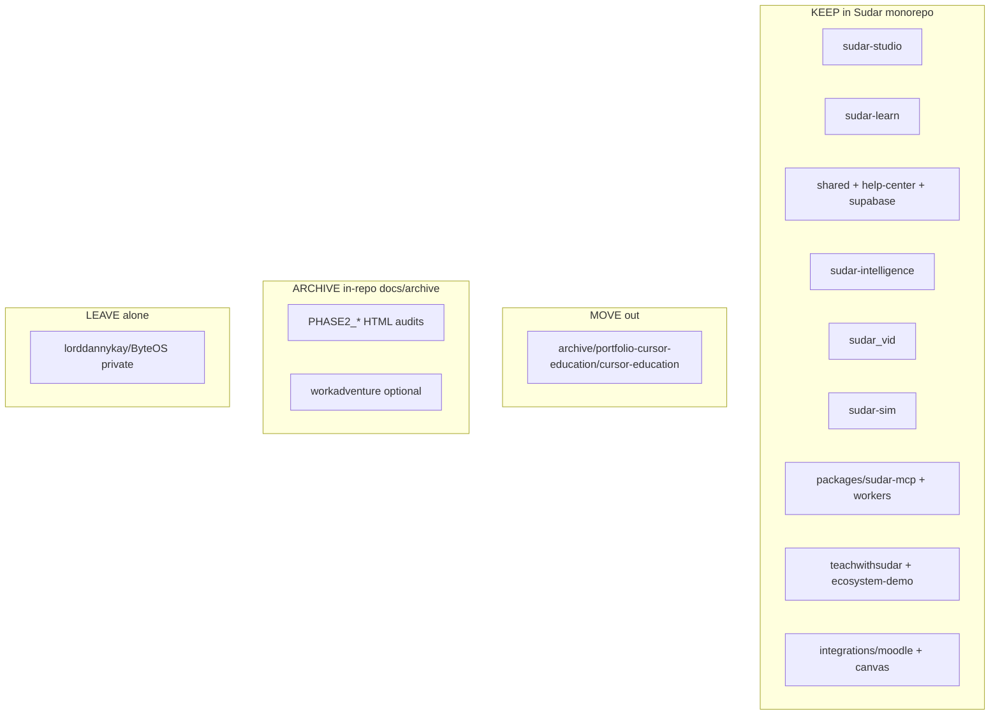

# Sudar — Structural cleanup audit (CTO pack)

**Date:** 2026-09-15  
**Scope:** Read-only audit (Steps 1–4). No runtime refactors executed.  
**Canonical product repo:** https://github.com/Dhanikesh-Karunanithi/Sudar  

This pack is the durable output of the four-part cleanup review. Step 1 findings are summarized; Steps 2–4 are full. For each step: **findings → recommended action → effort**.

**Trust order for status:** `UPDATES.md` Latest → `docs/SHIPPED_FEATURES.md` → code → then `ECOSYSTEM.md` / `AGENTS.md` (those two still lag; see Step 1).

---

## Step 1 — Repo/workspace audit (summary)

**Verdict:** One coherent product (~12 surfaces) whose canonical agent docs still describe a 4-app ByteOS tree. Talisma is a **pilot org slug**, not a second codebase.

| Gap class | Top items |
|-----------|-----------|
| Stale docs | AGENTS (14 templates, Prisma-in-both, `src/adaptive/`); ECOSYSTEM (NextAuth env, Vercel-as-prod, `byteos-*` microservices); PROGRESS (Vercel); root `PHASE2_*` / Phase 1 HTML |
| Orphans | Root HTML prototypes; unused Prisma deps; `audit/`; tiny `workadventure/` stub |
| Other-project | `archive/portfolio-cursor-education/cursor-education/` (job application) — highest-confidence SPLIT |
| Not orphans | `shared/`, `help-center/`, `sudar-sim/`, MCP package+workers, Moodle integrations, `teachwithsudar/` |

**Recommended action:** Accept map; do **docs truth-sync** (0.5d) before any repo surgery.  
**Effort:** Audit done; docs truth-sync **0.5 day**; archive-only move **1–2 hours**.

---

## Step 2 — Workspace / org separation plan

### Target structure (recommendation)

| Bucket | Paths | Rationale |
|--------|-------|-----------|
| **KEEP (core)** | `sudar-studio`, `sudar-learn`, `shared/`, `help-center/`, `supabase/`, `.github/workflows/sudar-*-cloudflare.yml` | Same deploy blast radius; TS path aliases; one schema |
| **KEEP (sibling services)** | `sudar-intelligence`, `sudar_vid`, `sudar-sim` | Same Supabase + HTTP contracts; no CI yet — fix deploy later, don't split first |
| **KEEP (distribution)** | `packages/sudar-mcp`, `workers/*`, `integrations/moodle`, `integrations/canvas`, `openapi/` | Product surface (MCP, ALP). Moodle is PHP ship channel — keep until a partner packaging repo is justified |
| **KEEP (marketing)** | `teachwithsudar/`, `sudar-ecosystem-demo/` | CI Pages + help-center sync; split only if marketing cadence diverges |
| **MOVE** | `archive/portfolio-cursor-education/cursor-education/` | Cursor job application + hire invite codes — not product |
| **ARCHIVE** | Root `PHASE2_*.md`, Phase 1 HTML, `audit/`, optionally `workadventure/` | Historical; zero runtime imports |
| **DO NOT SPLIT** | Talisma / Foundever | Customer rows + ops scripts on shared DB — Step 3 hygiene, not a repo |

**Options considered**

| Option | Pros | Cons | Choice |
|--------|------|------|--------|
| **A. Stay monorepo; archive + portfolio out** | Lowest risk; matches solo builder | Still large clone | **Recommended** |
| **B. Split marketing + MCP + Moodle now** | Cleaner product repo | Help-center/sync, dual CI, secret sprawl | Defer 3–6 months |
| **C. Split every service into its own repo** | Textbook micro-repos | Breaks `shared/` + migration coupling; multi-week | **Reject** for now |

### Migration checklist (if/when executing Option A)

#### Git history

1. Create private repo e.g. `Dhanikesh-Karunanithi/portfolio-cursor-education` (or personal org).
2. Prefer `git subtree split` / `git filter-repo --path archive/portfolio-cursor-education/cursor-education` so history is preserved; avoid copy-paste wipe.
3. Remove `portfolio/` from Sudar in a follow-up PR; update `SHIPPED_FEATURES` / ops scripts that reference hire codes.
4. Stop dual-push to `lorddannykay/ByteOS` for day-to-day work (`GITHUB_SETUP.md` is stale). Keep ByteOS private as archive only.

#### Env vars / secrets

| Concern | Action |
|---------|--------|
| One Supabase project `qnsrrboprydmjyormlky` for prod + staging pilots | **Do not** invent a second DB for portfolio; portfolio org can stay as a Sudar org or be deleted after freeze |
| Studio/Learn/Intelligence share `SUPABASE_*` + `INTELLIGENCE_SERVICE_SECRET` | Keep on same secret store (GitHub Actions + host env) |
| LiveKit / Deepgram / Cartesia live on Intelligence + `sudar-sim` | Document in ENV_REFERENCE (currently under-documented vs chat keys) |
| MCP worker secrets (`MCP_TOKEN_SECRET`, Studio OAuth) | Stay with Cloudflare account that owns `mcp.thesudar.com` |
| After portfolio move | Rotate any `CURSOR-HIRE-*` codes that were public |

#### CI/CD

| Surface | Today | After Option A |
|---------|-------|----------------|
| Learn / Studio / teachwithsudar | Cloudflare GH Actions | Unchanged |
| Intelligence | Manual Render/Railway (`render.yaml`) | Add deploy workflow later (separate ticket) |
| SudarVid / SudarSim / MCP / cron workers | Manual | Add workflows or document owner runbooks — **do not block separation** |
| Portfolio | Ops scripts only | CI lives in new repo if needed |

#### Supabase boundaries

- **Prod + staging = one project.** Staging = hostnames (`staging.learn.thesudar.com`) + org_id isolation (Talisma, Foundever), not a second Postgres.
- True workspace isolation later = new Supabase project + full migration replay + auth redirect rewrite — **multi-day, not part of Option A**.
- RLS/org policies must remain correct regardless of Git layout (Step 3).

### Step 2 — Findings / action / effort

**Findings:** Coupling that matters is `shared/` + `supabase/` + `help-center/`. Everything else is already a sibling. Splitting Studio from Learn would destroy velocity for a solo founder.

**Recommended action:** Option A — keep monorepo; MOVE portfolio; ARCHIVE Phase1/2 root docs + `audit/`; leave marketing/MCP/ALP in-tree; defer second Supabase project.

**Effort:** Portfolio split **0.5–1 day**; archive move **1–2 hours**; docs truth-sync (Step 1 follow-up) **0.5 day**; full service-repo split **1–2 weeks** (not recommended now).

---

## Step 3 — Security & privacy audit

**Verdict:** Would **not** clear a basic vendor security review for education data today. Several SECURITY.md controls are real; blockers are invite secrets in public git, incomplete RLS evidence for core identity tables, a broken `security:audit` gate, cross-tenant RAG ingest, and chat PII retention/DSAR gaps.

### Severity-ranked findings

#### Critical

1. **Public unlimited invite code** — `EARLY_TALISMA` in `supabase/migrations/20260617000002_seed_early_talisma_invite.sql` + `docs/PILOT_ONBOARDING.md`. Anyone can redeem if still active in prod.  
   *Fix:* Deactivate/rotate in live DB; never seed live invite secrets; single-use codes out-of-band.

2. **Core tenant tables lack in-repo RLS migrations** — Learner tables (`learner_profiles`, `ai_interactions`, …) have RLS; **no** `ENABLE ROW LEVEL SECURITY` for `profiles` / `organisations` / `org_members` / `courses` in migrations. Trust checklist still unsigned (`docs/trust/RLS_STORAGE_AUDIT_CHECKLIST.md`).  
   *Fix:* Run `scripts/sql/rls_audit.sql` on staging/prod; add missing policies; sign checklist.

3. **`npm run security:audit` is a false green** — `scripts/security-audit.mjs` still greps `createAdminClient()`; runtime uses `createServiceRoleSupabaseClient()`. CI reports 0 callsites.  
   *Fix:* Grep the new name; fail CI on unclassified service-role callsites.

4. **RAG ingest cross-tenant** — Authenticated Learn `rag/ingest` can service-role over all `published` courses / arbitrary `course_id` without org editor checks (`sudar-learn/src/app/api/rag/ingest/route.ts`).  
   *Fix:* Require org membership / content-editor role; never “all published” for learners.

#### High

5. **Studio middleware Bearer bypass** — Any `Authorization: Bearer …` on `/api/*` skips session **and** invite gates (`sudar-studio/src/middleware.ts`). Relies entirely on per-route auth.  
   *Fix:* Allowlist MCP/OAuth paths; validate JWT before bypass; keep invite for human sessions.

6. **Full tutor chat stored; weak retention/DSAR** — Raw `user_message` / `ai_response` in `ai_interactions`; org retention days are settings-only; `/api/me/data-export` omits bodies; OPERATIONS erase stub.  
   *Fix:* Retention job; complete export/erase; minimize storage; audit admin reads.

7. **Public hiring invite codes** — `CURSOR-HIRE-01/02/03` in `scripts/ops/provision-cursor-education-org.mjs` + portfolio demo docs.  
   *Fix:* Generate at provision time; rotate if live; leave with portfolio MOVE.

8. **Trust doc drift** — `AUDIT_LOG.md` vs `audit_events` migration; handoff still claims dead CORS / audit queue counts.  
   *Fix:* Sync trust pack to code before vendor share.

9. **CSRF / same-origin coverage narrow** — `rejectCrossSiteRequest` on few routes; not on high-volume `tutor/query`.  
   *Fix:* Apply to all cookie-auth mutating AI routes.

10. **Incomplete service-role IDOR inventory** — Historical ~100+ unreviewed callsites once audit worked.  
    *Fix:* Restore audit; classify; tenant tests.

#### Medium / Low (selected)

- CSP still `unsafe-inline` / `unsafe-eval` + broad `frame-src https:`.
- Invite validate endpoints without rate limit.
- `SUBPROCESSORS.md` missing Deepgram, Cartesia, LiveKit, Cloudflare, HF.
- Dev secret placeholders in `.env.example`; sim auth fail-open when secret unset in non-production.
- Positive controls that help: cron fail-closed; ALP org-scoped keys; embed HMAC; Intelligence JWT/service secret; learner-table RLS; AI keys server-side only (no `NEXT_PUBLIC_` provider keys found).

### Step 3 — Findings / action / effort

**Findings:** Highest vendor-fail risks are **access control (invites + RLS evidence + RAG)** and **education chat PII lifecycle**, not “AI keys in the browser.”

**Recommended action (order):**  
1) Rotate/deactivate public invites (same day).  
2) Fix `security:audit` + CI fail.  
3) Prove/fix RLS on identity/tenant tables; sign checklist.  
4) Lock RAG ingest.  
5) Tighten Studio Bearer/invite middleware.  
6) Retention + DSAR for `ai_interactions` / twin; expand `logAuditEvent`.  
7) Refresh trust pack + subprocessors.

**Effort:** Invite rotation **1–2 hours**; audit script fix **2–4 hours**; RLS prove+migrate **2–4 days**; RAG + middleware **1–2 days**; retention/DSAR **3–5 days**; trust doc sync **0.5 day**. **First week focus:** items 1–4 (~3–5 days).

---

## Step 4 — Model / market gap check

### (A) Model stack vs best-in-class

**What Sudar has (strength):** Multi-provider operator choice — org BYOM → Sudar AI (FreeLLMAPI) → OpenRouter → Together → OpenAI → Anthropic; custom/Ollama; HF on Intelligence; usage ledger + `ai_entitlements` + `estimateCost`; Listen Edge-TTS (+ Sarvam); Sim Deepgram STT + Cartesia TTS (Pipecat/LiveKit).

**Where it lags:**

| Gap | Evidence | Impact |
|-----|----------|--------|
| No first-class **reasoning** models (o-series, R1, etc.) | No routing/params; defaults `gpt-oss-20b` / `gpt-4o-mini` / Llama 3.x | Feels “cheap tutor” vs ChatGPT-class coaches |
| **Tutor is non-streaming** | Batch `chatCompletion`; Agents/Vid stream, main tutor does not | UX latency vs Docebo/Cornerstone AI coaches |
| Doc drift on provider order | `.cursorrules` still Together-first; code is OpenRouter-first | Agents configure wrong stack |
| Listen TTS not Cartesia-grade | Edge default; Cartesia Sim-only | Voice quality uneven across product |
| No productized model picker for frontier tiers | ModelPicker is UI shell; not a registry of reasoning/fast/cheap | Operators can't intentionally trade cost/latency |

**Recommended model action (not a rewrite):**  
1) Document OpenRouter-first + BYOM in ECOSYSTEM/AGENTS/ENV.  
2) Add optional **streaming** on `tutor/query` (SSE) with existing providers.  
3) Add one **reasoning** and one **fast** default per provider in org settings (IDs only — no new vendor).  
4) Keep cost defaults on OSS/small models for free tier.

**Effort:** Doc sync **2 hours**; streaming tutor **2–4 days**; dual-tier model defaults **1 day**.

### (B) Competitor feature gaps (LMS + AI)

Enterprise peers (Docebo, Cornerstone Galaxy, Absorb, Canvas IgniteAI) already ship or market heavily:

| They have | Sudar status | Priority for Sudar |
|-----------|--------------|--------------------|
| SAML/OIDC SSO, SCIM | Documented aspiration; not Studio surfaces | **High** for enterprise pilots |
| White-label / multi-tenant branded portals | Not shipped (pilot “Sudar AI” ≠ customer brand) | **High** for external academies |
| AI content → structured modules at scale (Docebo Shape) | Studio doc-to-course exists; polish/marketplace depth behind | Medium |
| Adaptive agents + role-play in suite (Cornerstone Spring 2026) | **SudarSim + Teaching OS** are real differentiators — lean here | Defend / deepen |
| Content marketplace (30k+ courses) | No marketplace | Low (open-source wedge, not SKU) |
| HRIS / talent suite | Explicit Phase later | Defer |
| SOC 2 / signed trust evidence | Trust pack exists; RLS/audit gates incomplete | **High** (Step 3) |

**Sudar wedge to double down on (ahead of closed LMS):** Teaching OS claim mastery, Digital Learner Twin + memory, SudarNotes, multi-modality author-once, ALP/MCP for existing LMS, SudarSim voice roleplay, open Apache-2.0.

**Do not chase next:** SudarFeed TikTok clone, full WorkAdventure SudarPlay, content marketplace.

### Step 4 — Findings / action / effort

**Findings:** Stack is **cost- and ops-flexible**, not **frontier-UX**. Market gap vs enterprise LMS is **identity/branding/compliance theater**, not “do we have a tutor.” Pedagogical spine is the moat.

**Recommended action:**  
1) Security week (Step 3) before more AI features.  
2) Streaming tutor + optional reasoning model IDs.  
3) One enterprise packaging slice: SSO **or** white-label (pick based on next pilot), not both at once.  
4) Deepen Teaching OS + Sim; archive Feed/Play from the critical path.

**Effort:** Model UX slice **~1 week**; SSO **or** white-label MVP **2–4 weeks**; Feed/Play **defer indefinitely**.

---

## Priority board (decisive recommendation)

| Priority | Item | Step | Effort | Why first |
|----------|------|------|--------|-----------|
| **P0** | Rotate public invites; fix `security:audit` | 3 | &lt;1 day | Vendor-fail + false CI green |
| **P0** | Docs truth-sync (AGENTS/ECOSYSTEM/PROGRESS) | 1 | 0.5 day | Stops agent thrash |
| **P1** | RLS prove + migrate core tables | 3 | 2–4 days | Education data |
| **P1** | RAG ingest org lock + Bearer allowlist | 3 | 1–2 days | Cross-tenant |
| **P2** | Archive Phase1/2 + MOVE portfolio | 2 | 1 day | Cognitive load |
| **P2** | Tutor streaming + model tier defaults | 4 | ~1 week | Competitive UX |
| **P3** | Retention/DSAR; trust pack refresh | 3 | ~1 week | Procurement |
| **P3** | SSO **or** white-label for next pilot | 4 | 2–4 weeks | Enterprise gate |
| **Defer** | Split marketing/MCP/Moodle repos; Feed/Play; second Supabase | 2/4 | weeks+ | Wrong fight |

**Do not refactor the monorepo layout until P0–P1 are done.**

---

## Sign-off

- [ ] Step 1 map accepted  
- [ ] Step 2 Option A accepted (or counter-choice)  
- [ ] Step 3 remediation order accepted  
- [ ] Step 4 model + market priorities accepted  

When ready to execute, start with **P0** in Agent mode (invite rotation ops + `security-audit.mjs` fix + docs truth-sync PR).
